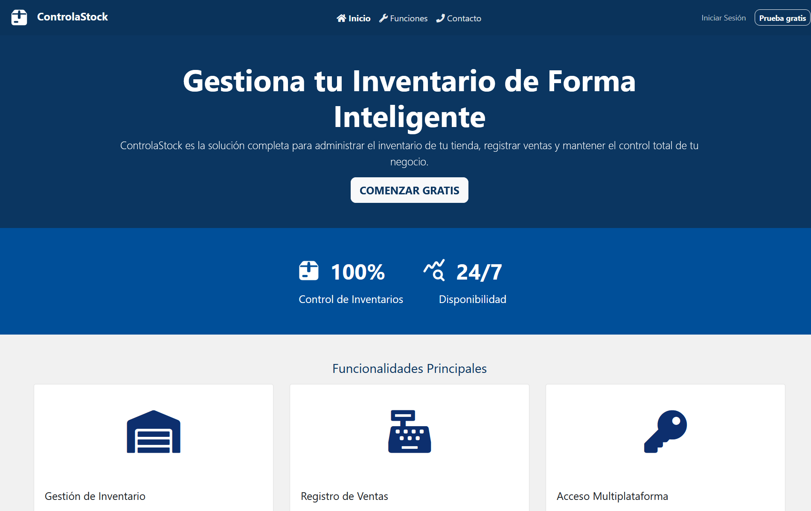
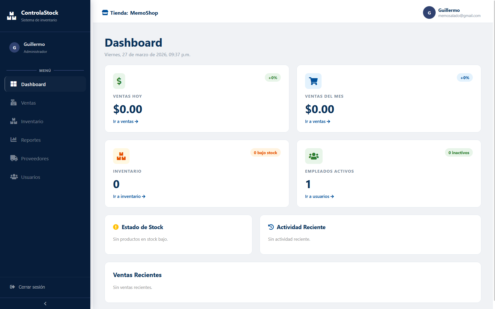

<h1 align="center">ControlaStock</h1>

<p align="center">
  
  
</p>

<p align="center">Sistema web de gestión de inventario y ventas para tiendas locales.</p>

---

## Vista previa

<p align="center">
  <table>
    <tr>
      <td></td>
      <td></td>
    </tr>
  </table>
</p>

---

## Descripción

**ControlaStock** es una aplicación web para administrar el inventario y las ventas de tiendas locales. Permite a administradores gestionar productos, empleados y reportes, mientras que los vendedores pueden registrar ventas y consultar el inventario en tiempo real.

---

## Funcionalidades

- Autenticación con roles — Administrador y Vendedor
- Gestión de inventario con alertas de stock bajo
- Registro de ventas con carrito y ticket de confirmación
- Historial de actividad por usuario
- Panel de administración de empleados
- Interfaz SPA con navegación sin recarga

---

## Tecnologías

### Frontend
<p>
  
  
  
</p>

### Backend
<p>
  
  
  
  
  
</p>

---

## Arquitectura

```
app/Http/Controllers/   →  lógica de negocio y respuestas API
routes/api.php          →  endpoints REST protegidos con Sanctum
routes/web.php          →  rutas HTML con catch-all por rol
public/views/           →  vistas HTML por rol (admin, users, shared)
public/js/              →  SPA router, controllers y templates
public/styles/          →  CSS modular sin frameworks
```

El frontend es una SPA en JavaScript Vanilla con History API. Cada rol tiene su propio shell HTML y el router inyecta los parciales correspondientes en el `<main>` según la vista activa.

---

## Roles

| `id_rol` | Rol | Acceso |
|---|---|---|
| 1 | Administrador | Dashboard · Ventas · Inventario · Reportes · Actividad · Usuarios |
| 2 | Vendedor | Dashboard · Ventas · Inventario |

---

## API

### Autenticación

| Método | Ruta | Descripción | Auth |
|---|---|---|---|
| `POST` | `/api/registro` | Registro de tienda y administrador | No |
| `POST` | `/api/login` | Inicio de sesión | No |
| `POST` | `/api/logout` | Cierre de sesión | Sí |
| `GET` | `/api/user` | Usuario autenticado | Sí |

**POST /api/login — Body:**
```json
{
  "tienda_nombre": "Abarrotes La Palma",
  "email": "admin@ejemplo.com",
  "password": "minimo6caracteres"
}
```

**POST /api/login — Respuesta:**
```json
{
  "token": "...",
  "usuario": { "id_rol": 1, "nombre": "Oscar", "email": "..." },
  "tienda": { "nombre": "Abarrotes La Palma" }
}
```

### Ventas

> Todas las rutas requieren token Bearer de Sanctum.

| Método | Ruta | Descripción |
|---|---|---|
| `GET` | `/api/ventas` | Listar ventas con filtros y paginación |
| `POST` | `/api/ventas` | Registrar nueva venta |
| `GET` | `/api/ventas/:id` | Detalle de una venta |
| `PATCH` | `/api/ventas/:id/cancelar` | Cancelar venta (solo admin) |

**POST /api/ventas — Body:**
```json
{
  "metodo_pago": "efectivo | tarjeta | transferencia",
  "observaciones": "Opcional",
  "items": [
    { "id_producto": 1, "cantidad": 2, "precio_unitario": 25.00 }
  ]
}
```

---

## Ejecutar con Docker

1. Clona el repositorio y configura las variables de entorno:
```bash
git clone https://github.com/CristoferTorres/ControlaStock.git
cd controlastock
cp .env.example .env
```

Edita el `.env` con tus credenciales:
```env
DB_PASSWORD=tu_password
DB_ROOT_PASSWORD=tu_root_password
DB_PASS=tu_password
```

2. Levanta los contenedores:
```bash
docker compose up -d --build
```

3. Genera la clave de la aplicación:
```bash
docker exec controlastock_app php artisan key:generate
```

4. Abre tu navegador en `http://localhost:8080`

> El schema se importa automáticamente al iniciar los contenedores por primera vez.

| Servicio | Imagen | Descripción |
|---|---|---|
| `app` | `php:8.3-apache` | Aplicación Laravel |
| `db` | `mariadb:10.4.24` | Base de datos MariaDB |

---

## Comandos útiles

```bash
# Ver logs del servidor
docker logs controlastock_app -f

# Acceder al contenedor
docker exec -it controlastock_app bash

# Reiniciar contenedores
docker compose restart

# Detener contenedores
docker compose down
```

---

## Autores

| Nombre | Rol en el proyecto |
|---|---|
| [Guillermo Salado](https://github.com/guillermosalado) | Backend · Frontend SPA · Administrador de base de datos
| [Cristofer Torres](https://github.com/CristoferTorres) | Programador |
| [Oscar Daniel](https://github.com/ReinuxGH) | Diseñador de la Interfaz |
| [José Ángel](https://github.com/josecisneros) | Documentador |

---

---

<p align="center">
  <a href="https://controlastock.dsm52.com">
    
  </a>
  <a href="https://github.com/CristoferTorres/ControlaStock">
    
  </a>
</p>